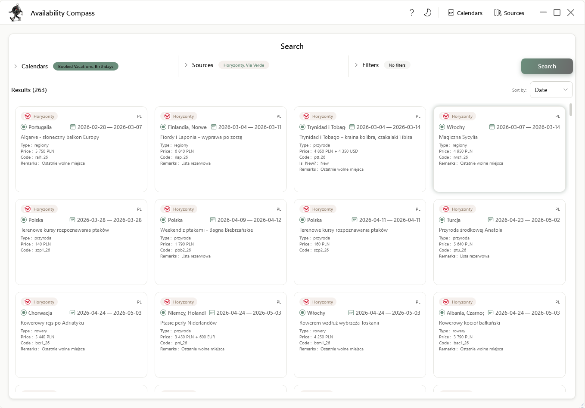
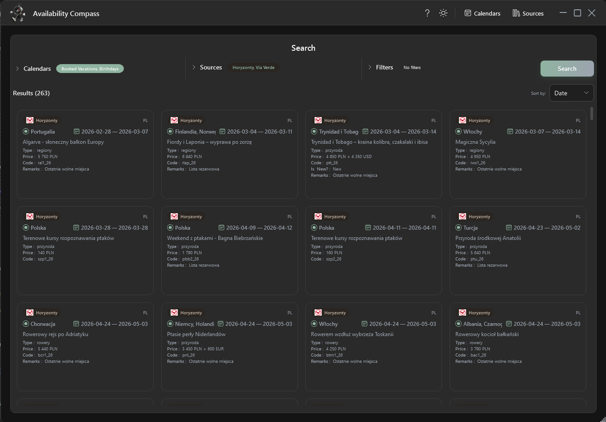
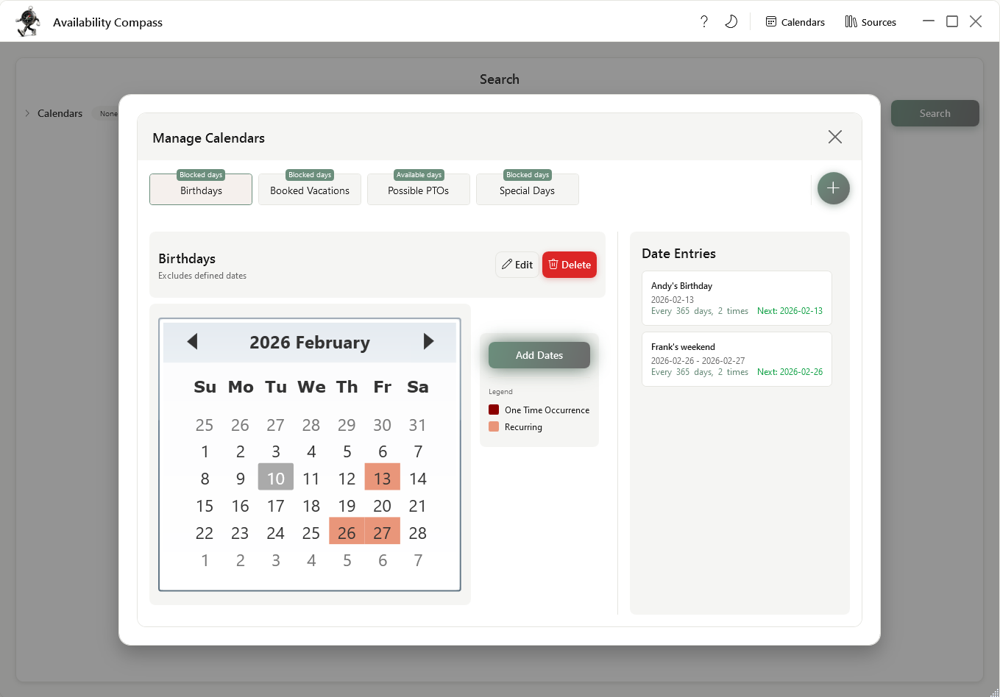
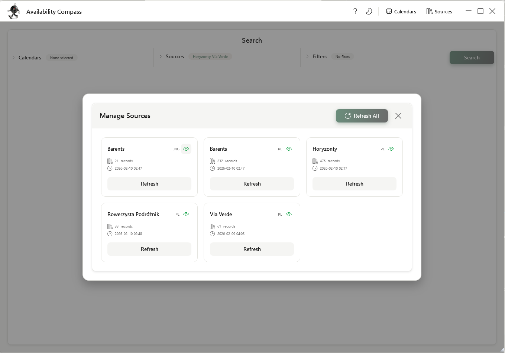

# Availability Compass

**Find group trips that fit everyone's schedule**



## Overview

Planning a group trip is hard. Coordinating availability across family and friends, then manually searching trip provider websites for matching dates is time-consuming and frustrating.

**Availability Compass** solves this by letting you define when each person is available (or unavailable), then automatically searches configured trip sources to find options that work for everyone.

## Features

- **Calendar Management** - Create calendars for each person with "available" or "blocked" date types, supporting both single dates and recurring patterns. Calendars can be used for filtering or for marking conflicts on results
- **Source Integration** - Connect to trip providers via web scraping, APIs, or AI agents with easy extensibility for new sources
- **Smart Search** - Filter results across multiple sources and calendars with date ranges, search phrases, and source-specific filters
- **Modern UI** - Glass-style design with light and dark theme support
- **Interactive Tutorial** - Comprehensive 34-step guided tour for new users learning the application

## Screenshots

### Search View

The main interface for searching across sources filtered by group availability.




### Calendar Management

Create and manage calendars with single or recurring date entries.



### Source Management

Configure and refresh data from trip providers.



## How It Works

1. **Set Up Calendars** - Create a calendar for each person. Mark dates as "Only" (available days) or "Except" (blocked days). Use recurring entries for regular commitments.

2. **Configure Sources** - Go to Sources and refresh data from your preferred trip providers. The app scrapes websites or calls APIs to get current offerings.

3. **Search & Book** - Select calendars and sources, apply filters, and search. Calendars can either filter results or mark conflicts on each result card. Click any result to open the booking page.

## Tutorial

First-time users are automatically greeted with a comprehensive 34-step interactive tutorial that walks through every feature of the app:

- **Creating and managing calendars** to define your availability
- **Refreshing trip sources** to get current offerings
- **Filtering and searching** with multiple criteria
- **Understanding conflict marking** vs filtering modes
- **Finding and booking trips** that match everyone's schedule

The tutorial automatically advances as you complete each task and remembers your progress. You can restart it anytime from the application menu—useful for refreshing your knowledge or showing others how to use the app.

For a detailed walkthrough with screenshots of each phase, see the [Interactive Tutorial Guide](src/AvailabilityCompass.Core/Features/Tutorial/README.md).

## Getting Started

### Prerequisites

- .NET 10.0 SDK

### Build and Run

```bash
# Build the solution
dotnet build availability-compass.sln

# Run the application
dotnet run --project src/AvailabilityCompass.WpfClient/

# Run tests
dotnet test tests/AvailabilityCompass.Core.Tests.Unit/
```

## Technical Details

This is a WPF application built with **Vertical Slice Architecture** and the **MVVM pattern**.

### Architecture Highlights

- **Two-project split**: `AvailabilityCompass.Core` (ViewModels, business logic) and `AvailabilityCompass.WpfClient` (XAML views)
- **Framework-agnostic ViewModels**: Using CommunityToolkit.MVVM for potential MAUI reuse
- **MediatR**: For command/query processing between slices
- **Reactive Extensions**: Custom EventBus for cross-slice push communication

### Tech Stack

- .NET 10.0 / WPF
- CommunityToolkit.MVVM
- MediatR
- System.Reactive (Rx.NET)
- SQLite with Dapper
- HtmlAgilityPack (web scraping)
- Custom "Glass" Design System (glassmorphic UI with theming)
- Guidely Tutorial Framework (interactive tutorial library)
- Serilog (structured logging)

## Extending the Application

### Adding New Trip Sources

1. Create a class implementing `ISourceService`
2. Mark it with the `[SourceService]` attribute
3. The application will automatically discover and register it

See existing implementations in `Features/ManageSources/Sources/` for examples.

## Architecture Design Records

Design decisions are documented in the [decisions](docs/decisions/) folder.
