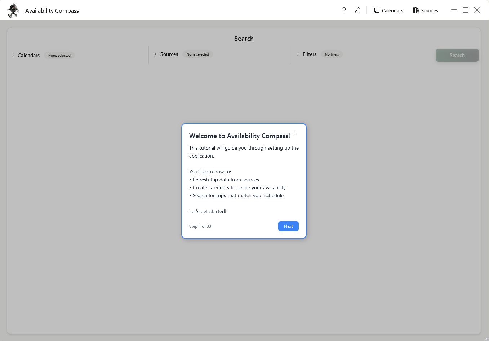
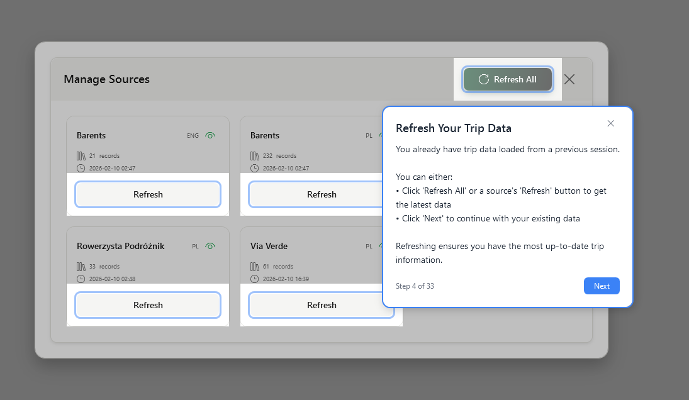
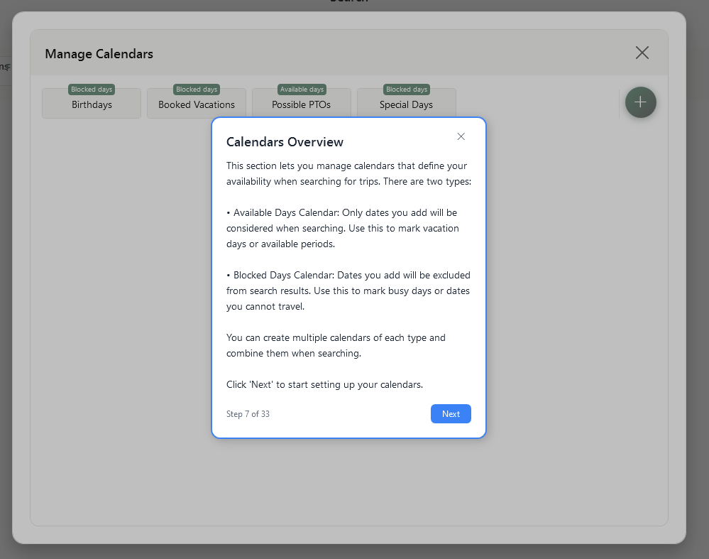
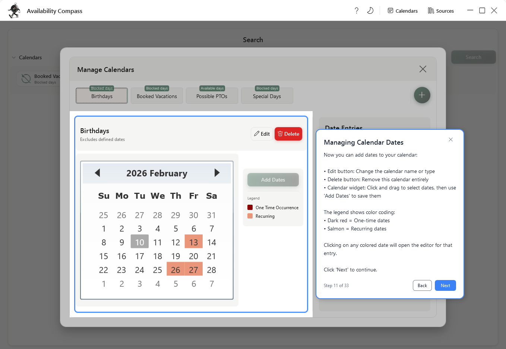
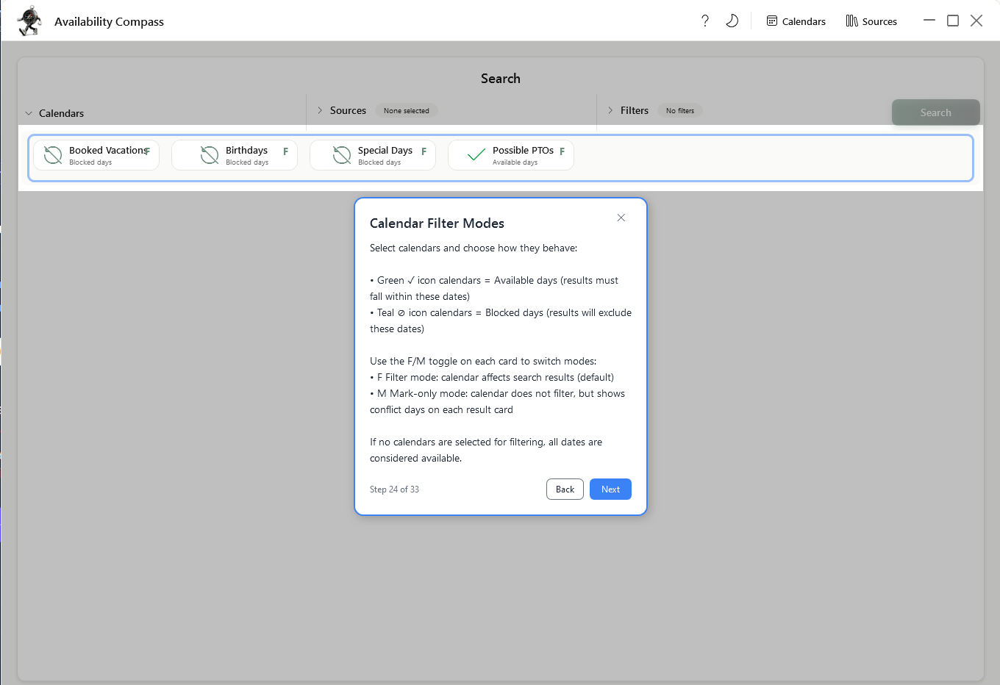
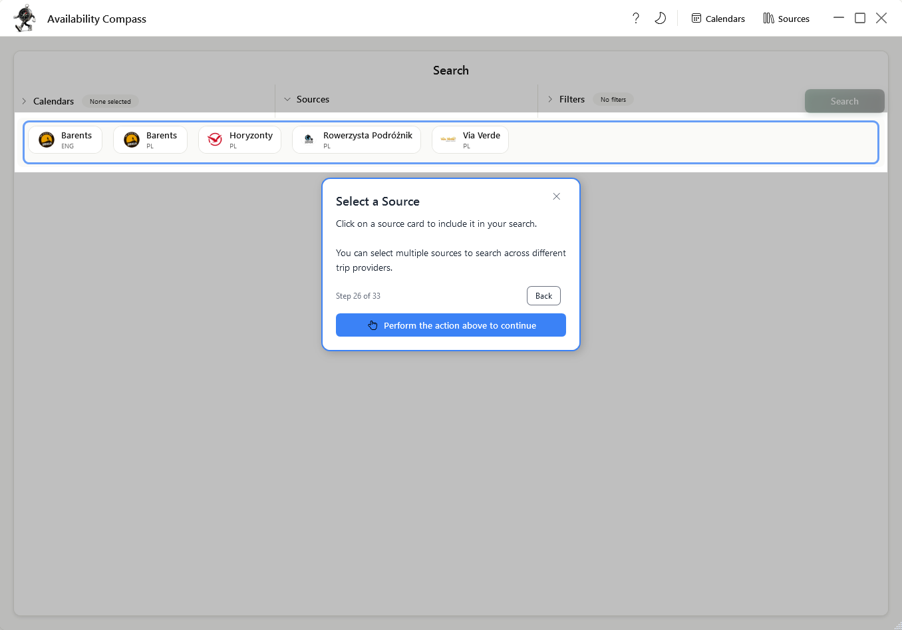
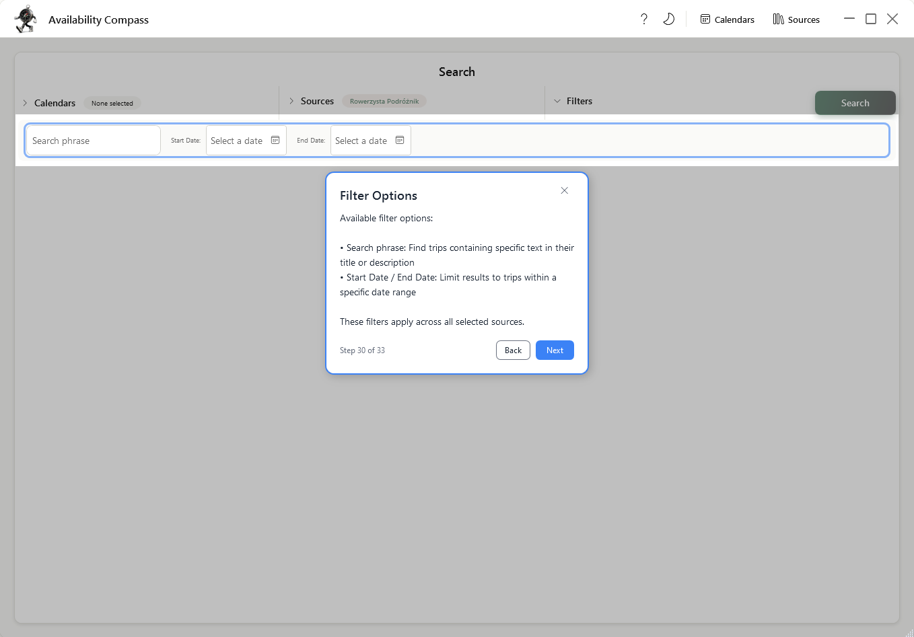
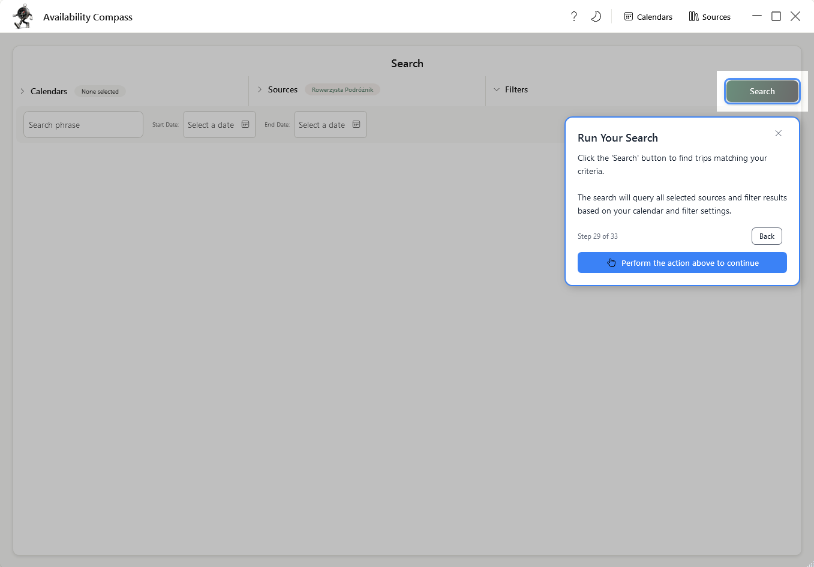
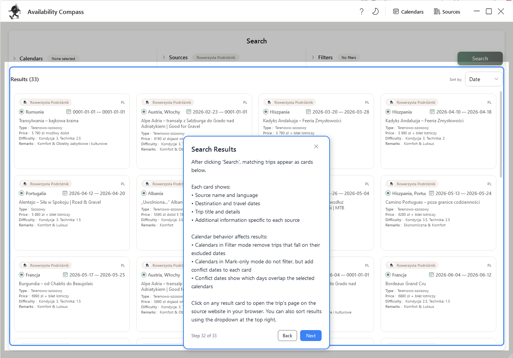
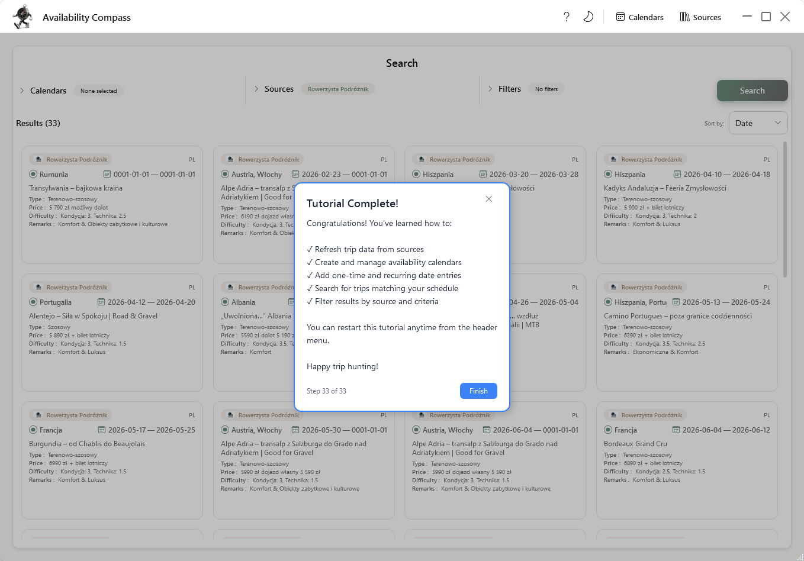

# Interactive Tutorial Guide

Welcome to the comprehensive walkthrough of **Availability Compass**! This guide explains the interactive 34-step
tutorial that helps new users learn the application.

## Table of Contents

1. [Overview](#overview)
2. [Tutorial Journey](#tutorial-journey)
    - [Phase 1: Introduction](#phase-1-introduction)
    - [Phase 2: Working with Sources](#phase-2-working-with-sources)
    - [Phase 3: Managing Calendars](#phase-3-managing-calendars)
    - [Phase 4: Searching for Trips](#phase-4-searching-for-trips)
    - [Phase 5: Completion](#phase-5-completion)
3. [Tutorial Features](#tutorial-features)
4. [Restarting the Tutorial](#restarting-the-tutorial)
5. [Tutorial Screenshots](#tutorial-screenshots)

---

## Overview

The interactive tutorial automatically greets first-time users and guides them through all major features of
Availability Compass step-by-step. Each step highlights the relevant UI element and explains what to do next.

### What You'll Learn

The tutorial teaches you how to:

- **Refresh trip data** from multiple travel providers
- **Create and manage calendars** to define your availability
- **Add single and recurring dates** to calendar entries
- **Use filtering and conflict marking** to find the perfect trips
- **Search across sources** with multiple filters applied
- **Book trips** that match your group's schedule

### Key Features

- **Auto-Advance**: The tutorial automatically moves to the next step when you complete an action
- **Skippable Steps**: Returning users can skip steps for data they've already created
- **Progress Persistence**: Your progress is saved and survives app restarts
- **Smart Restart**: Restart from the current view or from the beginning
- **Visual Guidance**: Highlighted elements with tooltips and contextual explanations

---

## Tutorial Journey

### Phase 1: Introduction

**Steps: 2 | Duration: ~1 minute**

The tutorial begins with a welcoming introduction that explains what you'll learn.

#### Step 1: Welcome

- Introduces the purpose of Availability Compass
- Outlines the three main topics covered
- Sets expectations for the tutorial duration

#### Step 2: Tutorial Usage

- Explains how to navigate the tutorial (Next, Back buttons)
- Describes the visual highlighting system
- Notes that you can skip or restart anytime

---

### Phase 2: Working with Sources

**Steps: 4 | Duration: ~2 minutes**

Learn how to refresh trip data from different providers.

#### Step 3: Opening Sources

- Points to the Sources button in the header
- Explains that sources represent different trip providers
- Guides you to open the Sources dialog

#### Step 4: Refreshing Trip Data

- Highlights the "Refresh All" button and individual refresh buttons
- Explains how to load the latest trip data
- Shows the progress indicator and completion status
- **Skippable**: If you've already refreshed sources, you can skip this step

#### Step 5: Waiting for Refresh

- Explains what happens while data is loading
- Shows the progress indicator
- Auto-advances when refresh completes and data loads

#### Step 6: Pointing to Calendars

- Transitions to the Calendars section
- Highlights the Calendars button
- Prepares you for managing availability

---

### Phase 3: Managing Calendars

**Steps: 12 | Duration: ~5 minutes**

Learn how to create calendars and define your availability.

#### Step 7: Calendars Overview

- Explains the two calendar types:
    - **Available Days**: Only these dates are considered when searching
    - **Blocked Days**: These dates are excluded from search results
- Notes that you can create multiple calendars of each type
- Shows how to combine calendars when searching

#### Step 8a: Click Existing Calendar (if you have calendars)

OR

#### Step 8b: Add New Calendar (if no calendars exist)

**Path A - Click Existing Calendar:**

- Highlights an existing calendar in the list
- Guides you to select it to view its details

**Path B - Add New Calendar:**

- Highlights the "Add Calendar" (+) button
- Explains how to create a new calendar
- Shows the form for entering calendar name and type

#### Step 9: Add Calendar Form Explanation

- Explains the calendar creation form
- Shows how to:
    - Enter a calendar name
    - Choose between "Available Days" and "Blocked Days"
- Demonstrates saving the calendar
- **Skippable**: If you already have calendars, you can skip to the next section

#### Step 10: Calendar View Overview

- Shows the calendar widget and date picker
- Explains how to navigate months/years
- Introduces the "Add Days" button for entering dates
- Shows the date entries panel with existing entries

#### Step 11: Adding Date Entries

- Explains how to add single dates or recurring patterns
- Shows the "Add Days" button
- Guides the process of selecting dates
- Auto-advances when you add a date entry
- **Skippable**: If you already have date entries, you can skip to the next section

#### Step 12: Date Entry Explanation

- Shows the list of date entries in the calendar
- Explains the date format and entry types
- Shows how to edit or delete entries
- Confirms that the calendar is now ready for searching

#### Step 13: Pointing to Search View

- Transitions from Calendars to Search
- Highlights the area outside the Calendars dialog
- Explains the next phase of using calendars in searches

---

### Phase 4: Searching for Trips

**Steps: 11 | Duration: ~4 minutes**

Learn how to use your calendars and filters to search for trips.

#### Step 14: Calendar Filter Explanation

- Shows the Calendar Filter section in the Search view
- Explains how to select which calendars to use
- Describes the two filtering modes:
    - **Filter Mode**: Only shows trips within selected dates
    - **Conflict Mode**: Shows all trips but marks conflicts

#### Step 15: Calendar Types Explanation

- Clarifies the difference between "Available Days" and "Blocked Days"
- Shows how combining calendars works
- Explains filter logic with multiple calendars

#### Step 16: Sources Filter Explanation

- Shows the Sources filter section
- Explains how to select which trip providers to search
- Notes that you can select one or multiple sources

#### Step 17: Selecting a Source

- Highlights a source in the filter panel
- Auto-advances when you select a source
- Shows that source-specific filters appear below

#### Step 18: Source Filter Options

- Explains source-specific configuration options
- Shows customizable filters for the selected provider
- Demonstrates saving filter preferences

#### Step 19: Global Filters Explanation

- Introduces date range filters
- Explains search term/phrase filtering
- Shows how to combine multiple filter types

#### Step 20: Filter Options Details

- Deep dive into individual filter fields
- Explains how to enter search terms
- Shows date range selection

#### Step 21: Search Button Explanation

- Highlights the "Search" button
- Explains that clicking will find all trips matching your filters
- Notes that this step requires user action

#### Step 22: Results Explanation

- Shows the search results section
- Explains the trip cards and their information
- Shows how to click a result to book

#### Step 23: No Results Explanation (conditional)

- Appears if the search returns no results
- Suggests adjusting filters and trying again
- **Skippable**: Auto-skipped if results are found

---

### Phase 5: Completion

**Steps: 1 | Duration: ~30 seconds**

#### Step 24: Tutorial Complete

- Congratulates you on completing the tutorial
- Offers encouragement to explore and book trips
- Explains how to restart the tutorial anytime
- Clicking "Finish" completes the tutorial

---

## Tutorial Features

### Auto-Advance

Most steps automatically advance when you perform the expected action. For example:

- When you refresh a source, the tutorial moves to the next step
- When you add a calendar, it advances
- When you select a calendar filter, it continues

This keeps the tutorial moving without requiring constant "Next" button clicks.

### Skippable Steps

Some steps can be skipped if the required condition is already met. For example:

- If you've already refreshed sources, you can skip the refresh step
- If you already have calendars, you can skip the calendar creation steps
- If your search returns results, you skip the "no results" explanation

When a step is skippable:

- The step shows alternative content explaining you can skip it
- A "Next" button appears to continue
- You can also perform the action anyway (e.g., refresh again)

### Progress Persistence

Your tutorial progress is automatically saved. If you:

- Close the application mid-tutorial, your progress is preserved
- Reopen the app, you resume from where you left off
- Don't lose progress if the app crashes

### Visual Guidance

The tutorial uses several visual techniques to guide you:

- **Highlighting**: The relevant UI element has a pulsing border to draw your attention
- **Tooltips**: Contextual information appears near the highlighted element
- **Overlay**: A semi-transparent overlay blocks interaction with other UI elements
- **Button Focus**: Target buttons can be clicked through the overlay while others are blocked

### Restart Options

You have two ways to restart:

**Full Restart**: Start from the very beginning (Welcome step)

- Useful for learning the full flow again
- Accessed via the application menu

**Smart Restart**: Restart from the current view

- Starts from the tutorial section matching what you're currently viewing
- If you're looking at calendars, restart from the calendar steps
- If you're searching, restart from the search steps
- Useful for refreshing knowledge about a specific feature

---

## Restarting the Tutorial

### How to Restart

1. **From the Menu**: Look for a "Tutorial" or "Help" menu option
2. **Choose Your Option**:
    - **Restart Tutorial**: Start from the beginning
    - **Restart From Here**: Start from the current section

### When to Restart

You might want to restart the tutorial if you:

- Want to refresh your knowledge of a feature
- Are showing someone else how the app works
- Got interrupted and want to resume properly
- Want to see the full flow again

### Notes

- Restarting will reset your progress if you had partially completed the tutorial
- Your data (calendars, sources) is not affected by restarting
- You can skip steps you've already completed

---

## Tutorial Screenshots

This section shows the tutorial in action. Each screenshot demonstrates a key moment in the guided experience.

### Introduction Phase

*Step 1: The welcome screen greets you and explains what you'll learn*

### Sources Phase

*Step 4: Highlighting refresh buttons and explaining data loading*

### Calendars Phase

*Step 7: Explaining the two calendar types and how they work*

*Step 9: The calendar creation form with guided input*

*Step 10: Selecting dates with the calendar widget*

### Search Phase

*Step 14: Selecting calendars to filter search results*

*Step 16: Choosing which trip providers to search*

*Step 19: Date range and search term filters*

*Step 22: Performing a search and viewing results*

### Completion Phase

*Step 24: The completion screen with next steps*

---

## Technical Reference

For developers integrating with the tutorial system, see
the [Tutorial System Documentation](../../../../../../docs/tutorial-system.md) which covers:

- Guidely framework architecture
- Tutorial step definitions and attributes
- Trigger mechanisms and context updates
- Implementing custom tutorial steps
- Persistence and state management

The tutorial implementation in this feature uses:

- **Framework**: Guidely (custom tutorial state machine library)
- **Steps**: 34 interactive steps defined as classes in the `Steps/` folder
- **Configuration**: Transitions and flow logic in `TutorialSetup.cs`
- **State**: Tutorial progress persisted via the application settings
